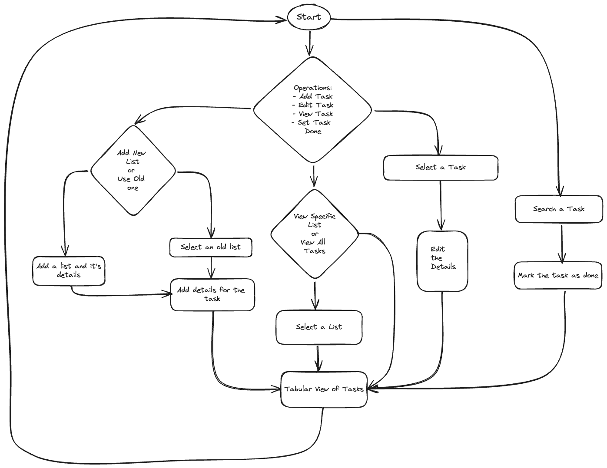

# To Do List Manager

<!-- Badges for status and other compliances-->

This is a simple to do list manager that allows you to add, remove, and view tasks. It is written in Go language and uses a SQLite database to store tasks.

The Task Manager is built over 3 entities:
- **List**: A list of tasks that can be seen or understood as a collection of related tasks.
- **Task**: A task is a single unit of work that needs to be done.
- **Tag**: A tag is a label that can be associated with a task to categorize it.

## Features
- [-] Create a list
- [-] Add a task to the list
- [-] Set the status of a task as completed
- [-] View all tasks in the list
- [-] Add a tag to a task
- [-] Remove a tag from a task
- [-] View all tasks with a specific tag
- [-] List all tasks on different criteria like status, creation time, etc.
- [-] Set Priority to a task

## Working of the application
What I intend this application to do is to provide a simple CLI based interface to manage tasks. The user can add, remove, and view tasks. The tasks are stored in a SQLite database.

The application is divided into three main parts:
1. **Database**: The database is used to store tasks. It has a single table `tasks` with columns `id` and `task`.
2. **CLI**: The CLI is used to interact with the user. It provides options to add, remove, and view tasks.
3. **Application Logic**: The application logic is used to interact with the database and perform operations like add, remove, and view tasks.

